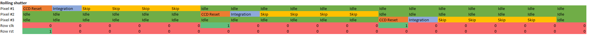
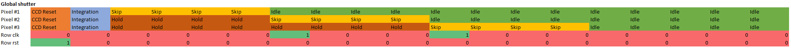

# Skipper-in-CMOS Image Sensor: module Documentation

The `CIS_Control` module is designed to implement waveforms for controlling the Skipper-in-CMOS Image Sensor (CIS). 
The module generates control signals for the CIS based on input signals such as `clk`, `reset`, `integration`, and programmable patterns.

## Table of Contents
1. [Module Description](#module-description)
2. [Module Parameters](#module-parameters)
3. [Module Inputs and Outputs](#module-inputs-and-outputs)
4. [Clock Divider Circuit](#clock-divider-circuit)
5. [Finite State Machine (FSM)](#finite-state-machine-fsm)
6. [Pattern Buffer and Output Assignments](#pattern-buffer-and-output-assignments)
7. [Shutter: global vs rolling](#shutter)

### 1. Module Description

The `CIS_Control` module is an RTL block responsible for generating control signals for a Skipper-in-CMOS Image Sensor. 
These control signals trigger various operations such as CCD reset, integration, and skipping (sampling of pedestal and signal). 
The module supports flexible pattern sequences and is designed to handle different phases of CIS operation.

### 2. Module Parameters

The `CIS_Control` module includes the following parameters:

- `NUM_SIGNALS`: Number of signals provided by `CIS_Control` (excluding ClkRow and ClkRst).
- `PIXEL_CLUSTER_SIZE`: Size of pixel clusters. Default is 16.
- `PATTERN_LEN`: Length of programmable patterns in clock cycles.

### 3. Module Inputs and Outputs

The `CIS_Control` module has the following inputs and outputs:

#### Inputs:
- `clk`: Clock signal.
- `reset`: Reset signal (active high).
- `clk_div`: Clock divider value.
- `global_shutter`: Enable Global shutter mode.
- `integration`: Integration signal, active high.
- `skip_samples`: Number of skipping samples for each skipping phase.
- `pattern_ccd_reset`: Programmable pattern for CCD reset.
- `pattern_integration`: Programmable pattern for integration.
- `pattern_skipping`: Programmable pattern for skipping.

#### Outputs:
- Control signals for the CIS pixel: `cis_PDrst`, `cis_TG1`, `cis_TG2`, `cis_SG`, `cis_DG`, `cis_OG`, `cis_FG_RST`.
- Control signals for CIS pixel selection logic: `cis_RowRst`, `cis_RowClk`.
- Control signals to identify sampling of pedestal/signal: `sprocket_SIG`, `sprocket_PED`.

### 4. Clock Divider Circuit

The module includes a clock divider circuit that generates a `clk_div_en` pulse every `clk_div` clock cycles. 

### 5. Finite State Machine (FSM)

The module includes an FSM that manages the control signal generation based on the input signals and patterns. 
The FSM has the following states:

- `IDLE`: Initial state.
- `CCD_RESET`: CCD reset state.
- `INTEGRATION`: Integration state.
- `SKIPPING`: Skipping state.

The FSM transitions between these states based on the selected operation mode (rolling/global shutter).

### 6. Pattern Buffer and Output Assignments

The module uses a `pattern_buffer` to store the current pattern. 
The pattern is shifted and modified based on the state of the FSM. 
The output control signals are assigned based on specific bits of the `pattern_buffer` corresponding to various control signals.
NOTE: pattern is generated from MSB to LSB! (for simplicity of writing patterns in a text editor, so that sequence is read left to right)

Mapping of pattern array to signals is the following:
- pattern_*[0] = CIS_PDrst
- pattern_*[1] = CIS_TG1
- pattern_*[2] = CIS_TG2
- pattern_*[3] = CIS_SG
- pattern_*[4] = CIS_OG
- pattern_*[5] = CIS_DG
- pattern_*[6] = CIS_FG_RST
- pattern_*[7] = SPROCKET_PED
- pattern_*[8] = SPROCKET_SIG

### 7. Shutter: global vs rolling
- Rolling shutter: the three FSM states are executed sequentially, then we switch to next pixel (need a new integration pulse).

  
- Global shutter: `CCD_RESET` and `INTEGRATION` are executed in parallel for all pixels, then skipping phase is repeated for each pixel (only one integration pulse is required). 

Contact: Lorenzo Rota - SLAC, lorenzor@slac.stanford.edu
